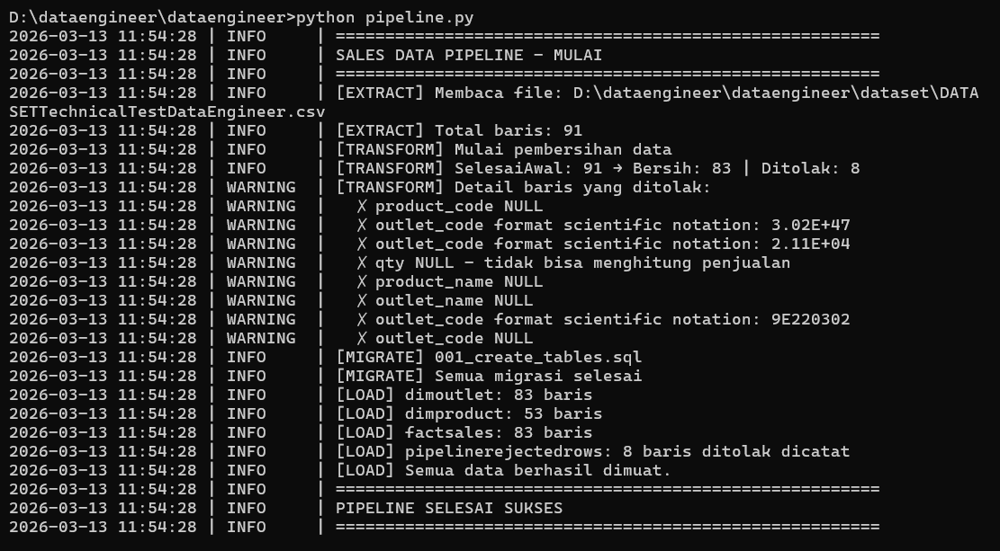
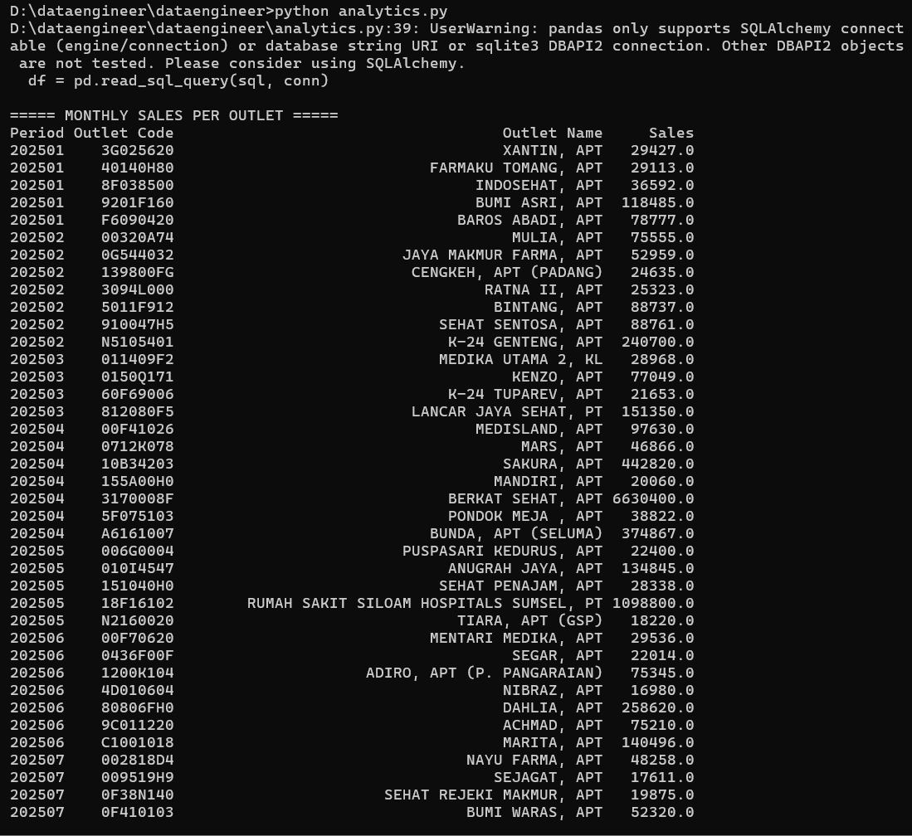
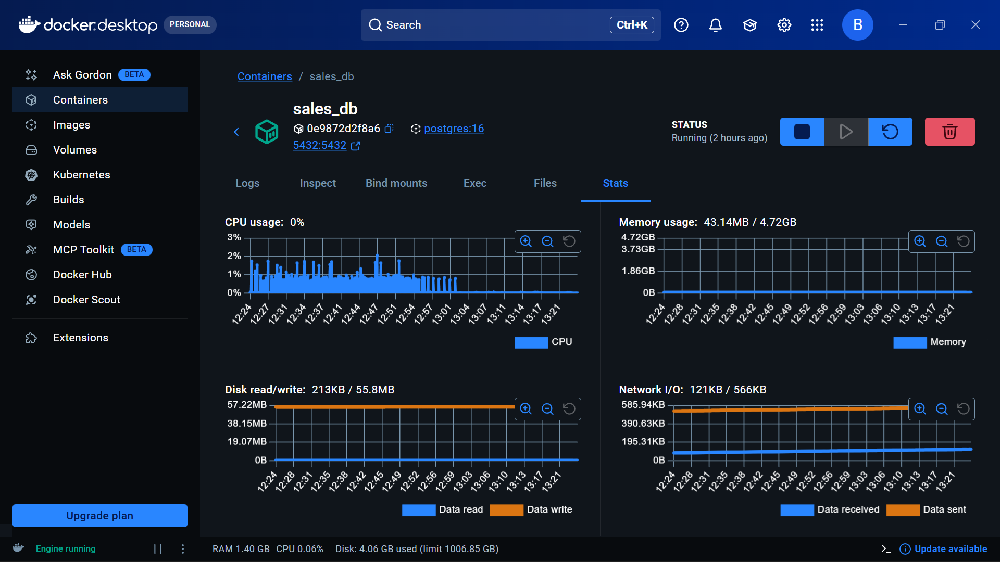
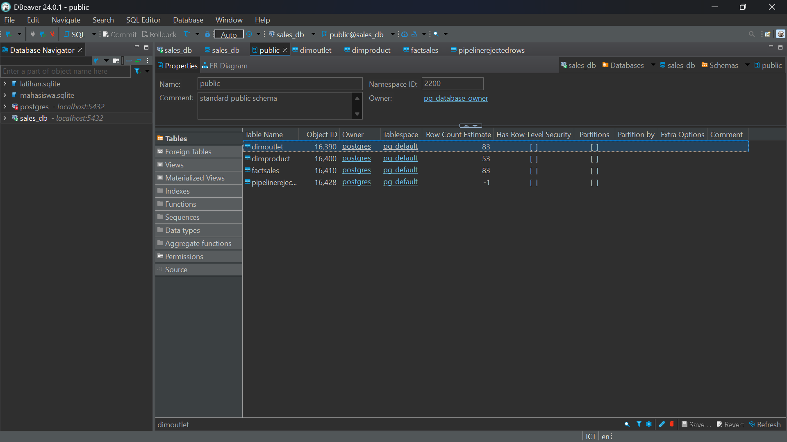

# Setup Instructions

## Prerequisites

* Python 3.10+
* Docker Desktop
* DBeaver

## Installation

1. Clone repository

```bash
git clone https://github.com/balqiszamzami/dataengineer.git
cd dataengineer
```

2. Install dependencies

```bash
pip install psycopg2-binary pandas openpyxl
```

3. Menjalankan PostgreSQL menggunakan Docker

```bash
docker run -d --name sales_db \
-e POSTGRES_USER=postgres \
-e POSTGRES_PASSWORD=postgres \
-e POSTGRES_DB=sales_db \
-p 5432:5432 postgres:16
```

---

# How to Run

1. Menjalankan pipeline

```bash
python pipeline.py
```

2. Menjalankan query analytics

```bash
python analytics.py
```

---

# Data Pipeline Result



Pipeline terdiri dari beberapa tahap:

1. **Extract** –> membaca dataset CSV
2. **Transform** –> melakukan data cleaning dan validasi
3. **Load** –> menyimpan data yang sudah bersih ke PostgreSQL
4. **Reject Handling** –> menyimpan data yang invalid ke tabel `pipelinerejectedrows`

---

# Assumptions

1. Tidak terdapat `transaction_id` pada dataset, sehingga proses deduplikasi tidak dapat dilakukan berdasarkan ID unik.
2. `product_code` dalam format float (misalnya `442946.0`) dikonversi menjadi string integer (`442946`).
3. `outlet_code` yang berada dalam format scientific notation tidak dapat dipulihkan ke kode aslinya, sehingga baris data tersebut ditolak.
4. `actual_sales = 0` dengan `qty = NULL` dianggap sebagai transaksi yang tidak valid.
5. Semua harga diasumsikan menggunakan mata uang Rupiah Indonesia (IDR).

---

# Data Cleaning

| # | Issue                                      | Action  | Reason                                        |
| - | ------------------------------------------ | ------- | --------------------------------------------- |
| 1 | outlet_code scientific notation (3.02E+47) | Removed | Tidak dapat memulihkan kode outlet asli       |
| 2 | outlet_code scientific notation (2.11E+04) | Removed | Tidak dapat memulihkan kode outlet asli       |
| 3 | outlet_code scientific notation (9E220302) | Removed | Tidak dapat memulihkan kode outlet asli       |
| 4 | outlet_code NULL                           | Removed | Tidak ada referensi outlet                    |
| 5 | outlet_name NULL                           | Removed | Data outlet tidak lengkap                     |
| 6 | product_code NULL                          | Removed | Tidak dapat dihubungkan dengan dimensi produk |
| 7 | product_name NULL                          | Removed | Data produk tidak lengkap                     |
| 8 | qty NULL, actual_sales = 0                 | Removed | Transaksi tidak valid                         |

Total: **91 rows input → 83 rows clean, 8 rows rejected**

Semua baris yang ditolak dicatat pada tabel `pipelinerejectedrows` untuk keperluan audit.

---

# Analytics



Query ini menghitung:

**Monthly Sales per Outlet**

---

# Other Documentation



